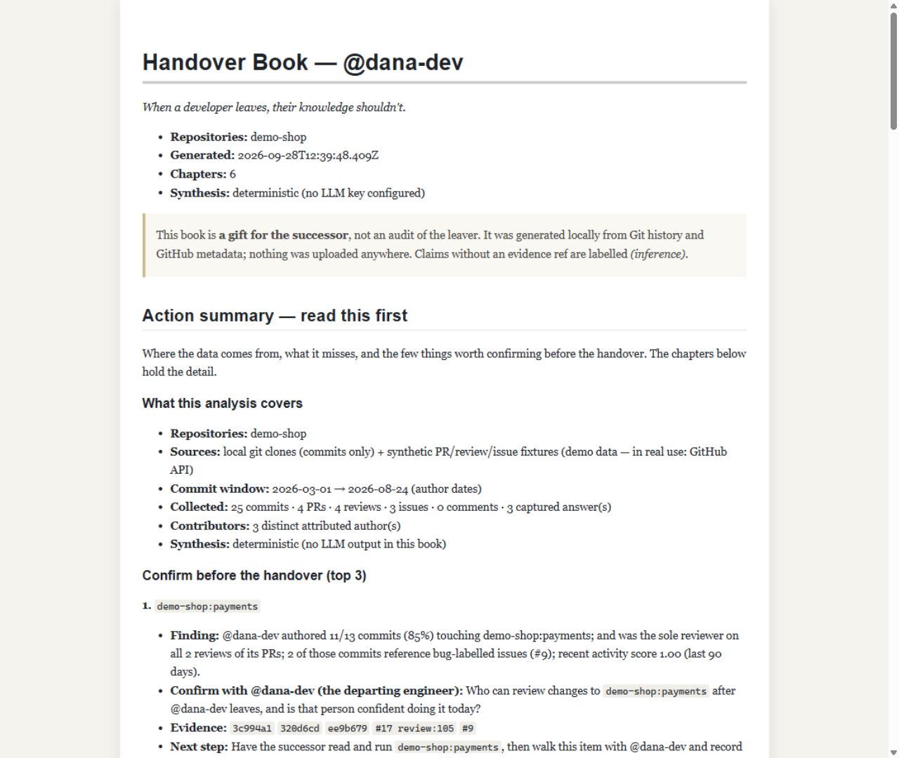

[English](README.md) | **简体中文** | [繁體中文](README.zh-TW.md) | [日本語](README.ja.md) | [Español](README.es.md) | [Français](README.fr.md) | [Русский](README.ru.md) | [Deutsch](README.de.md) | [Монгол](README.mn.md) | [العربية](README.ar.md)

> 社区翻译在安装步骤与数据流说明上可能滞后于英文版 README。

[](https://github.com/a742987/Handover/actions/workflows/ci.yml)
[](https://www.npmjs.com/package/handover-book)

# Handover（交接手册）

**开发者离开时，他们的知识不应该随之离开。**

Handover 把 Git 历史和 PR 讨论整理成一份证据可溯的交接手册，交给下一位维护者：找出维护记录集中的模块，回溯关键决策的原始讨论，列出交接前需要确认的问题 —— 每条论断都能回链到它出自的 commit、PR、review 或 issue。



**[阅读完整样例](examples/sample-report/handover-book-dana-dev.md)** · **[查看演示脚本](docs/demo-script.md)** · **[开始使用](#快速开始)**

在本地运行。配置远程 LLM 时，所选仓库资料会被发送到你配置的提供商；本地 Git + 确定性输出是更简单的起步路径 —— 详见[数据流与边界](#数据流与边界--选择路径前请先读这一节)。

## 为什么需要它

`git blame` 能告诉你某一行是*谁*写的，却无法告诉你*为什么* —— 也无法告诉你哪些模块会悄悄失去唯一的评审者，或者哪些"奇怪"的设计决策其实是承重核心。Wiki 依赖人们自发地书写，而离职面谈总是在辞职宣布之后才开始、在知识传递完成之前就结束。

手册共六章，全部由你的仓库计算得出：

1. **代码全景** —— 他们 touch 过的每一个模块、其状态与历史
2. **隐性知识清单** —— 他们是*唯一*作者或*唯一*评审者的模块
3. **风险 Top 5** —— "他们离开后什么会出问题"，逐项排序打分，每项附带证据链
4. **决策考古** —— "当年我们为什么这样选"，引用真实的 PR/issue 讨论原文
5. **30 天上手路径** —— 接任者的学习计划
6. **问题与答案草稿** —— 交接前该问什么，加上离职工程师本人录制的第一人称回答

每本手册都以**行动摘要**开篇：本次分析覆盖什么、缺少什么、最值得优先确认的几件事。每条论断都引用证据；无依据的判断标注 *(inference)*；只有用 `handover capture` 录制的回答才以本人语气呈现。`handover verify` 会检查成书中每一条引用在索引中真实存在。

## 快速开始

最短路径 —— 一条命令，无需克隆仓库（需要 Node ≥ 22.13）：

```bash
npm install -g handover-book

# 从 GitHub 采集（建议设置 token 以获得合理的速率限制）：
export GITHUB_TOKEN=ghp_...
handover gen <username> --repo owner/name --html

# 或者完全不用 token、不用联网 —— 直接读本人的本地克隆：
handover gen <username> --git-dir ~/work/api --git-dir ~/work/web
```

输出位于 `handover-data/`：

- `handover-data/<username>.db` —— 本地 SQLite 索引（每人一个文件；第二次运行增量更新，几乎瞬间完成）
- `handover-data/handover-book-<username>.md` —— 装订成册的手册（加 `--html` 会同时输出可直接打印的单文件 HTML —— 浏览器打印即得 PDF）

想从源码运行？`git clone https://github.com/a742987/Handover && cd Handover && npm install && npm run dev -- gen <username> --repo owner/name`。

还不确定值不值得装？[先读完整样例报告](examples/sample-report/handover-book-dana-dev.md) —— 一份明确标注合成场景、未经修改的完整手册，附关键论断的人工核验记录。

生成的报告里有看起来不对的论断？这是对我们最有用的反馈：[提交一个 report-quality issue](../../issues/new?template=false_positive.yml)，附上原文和对应的证据 ref。

### 命令

| 命令 | 作用 |
|---|---|
| `gen <username> -r owner/name` | 采集 → 分析 → 渲染出完整手册 |
| `gen <username> -d ~/clone/dir` | 同样流程，但直接读**本地 git 克隆** —— 无需 token、无需联网，GitLab/Gitee 也能用 |
| `collect <username> -r owner/name [-d dir]` | 仅索引历史（索引中已有的 commit、PR、review 和 issue 会被跳过） |
| `capture <username>` | 与离职工程师本人对谈，把 TA 的第一人称回答装订进第 6 章（`--answers q.json` 供 agent/脚本非交互使用） |
| `risk <username> [--json]` | 从本地索引打印风险 Top 5 |
| `bus-factor <username>` | 团队视角：哪些模块只有一个人在提交，并在仓库带 CODEOWNERS 时合并之 |
| `gate <username> --files changed.txt` | CI 检查：这组变更是否触碰了独占模块？（`--comment`、`--fail-on-match`、`--repo owner/name` 用于限定多仓库索引；示例见 [`examples/sole-owner-gate-action.yml`](examples/sole-owner-gate-action.yml)） |
| `verify <username>` | 引用存在性检查：成书中引用的每一条证据 ref 都必须存在于索引中（有缺失时退出码为 1 —— 可用于 CI，`--json` 供机器读取） |
| `render <username>` | 从索引重新渲染手册，不访问 GitHub（第 4-6 章仅在配置了 API 密钥时才调用 LLM 提供方；可用 `-r` 覆盖索引中记录的仓库） |

常用参数：`--provider openai|anthropic|ollama`、`--model <model>`、`--since <ISO date>`（省略时区的时刻按 UTC 处理）、`--data-dir <dir>`、`--refresh`（重新抓取已索引的内容）、`--html`（可打印 HTML 双胞胎）、`--redact`（在送入 LLM 摘要和成书前清除已知密钥格式；也可用 `HANDOVER_REDACT=1`）、`--no-llm`（即使配置了密钥也跳过 LLM 合成 —— 仅输出确定性章节，任何内容都不离开本机；也可用 `HANDOVER_NO_LLM=1`）。`gen` 与 `collect` 还接受 `--author <identity>` 用于在本地克隆中匹配离职者的姓名/邮箱；`capture --list` 打印已录制的答案；`bus-factor` 支持 `--top <n>`、`--window <days>` 与 `--json`（供 CI 使用）。

## 数据流与边界 —— 选择路径前请先读这一节

采集和索引始终在你的机器上完成。之后发生什么取决于你选择的路径：

| 路径 | 适合谁 | 需要知道的 |
|---|---|---|
| **本地 Git + 确定性输出**（`--git-dir`，无 LLM 密钥或加 `--no-llm`） | 第一次试用、代码敏感、要推荐给环境受限的团队 | 没有 GitHub 的 PR / review / issue 讨论 —— "为什么"类决策和评审覆盖缺失；第 4-6 章为确定性摘要。手册的行动页会明确写出这一缺口。 |
| **GitHub + 确定性输出**（`-r owner/name` + `GITHUB_TOKEN`，`--no-llm`） | 想要讨论记录、但先不用 LLM 的团队 | 需要 GitHub token（私有仓库需 repo 权限）；第 4-6 章是对最丰富讨论的确定性摘录。 |
| **GitHub / 本地 Git + 远程 LLM**（`ANTHROPIC_API_KEY` / `OPENAI_API_KEY`） | 需要第 4-6 章叙述性内容 | 收集到的仓库资料会被发送到所配置的提供商进行合成。未配置密钥时，运行过程不会联系任何 LLM，并退回到确定性章节而非报错。 |
| **本地 Git + 本地模型**（`--provider ollama`） | 希望合成过程留在本机 | 需要本地运行 [Ollama](https://ollama.com)；模型合成质量未经充分实测 —— 请自行核验输出。 |

`--no-llm` / `HANDOVER_NO_LLM=1` 是显式的关闭开关：即使环境里有密钥，也不会发送任何内容。"本地运行"指的是采集、索引和渲染 —— 当配置了远程提供商时，它**不等于**"仓库内容绝不离开本机"。

### LLM 提供方

第 1–3 章直接从索引确定性计算 —— 无论有没有 API key 都能正常工作。第 4–6 章在配置了 LLM 时由其生成。

- **Anthropic** —— 设置 `ANTHROPIC_API_KEY`（默认提供方）
- **OpenAI** —— 设置 `OPENAI_API_KEY`，并以 `--provider openai` 运行
- **Ollama** —— 完全本地、无需 key：启动 Ollama 后以 `--provider ollama` 运行

每个 LLM 章节都遵守一条硬性规则：**要么有证据链，要么不作数。**模型无法用 commit、PR、review 或 issue 引用来支撑的论断，必须标注 *(inference)*（推断）。第 6 章绝不冒充离职工程师本人：AI 草稿答案会明确标注为待确认草稿，只有 `handover capture` 录制的回答才是第一人称。分发手册前请先运行 `handover verify`。

## 风险如何打分（以及为什么你可以信任它）

```
risk = sole_contribution_ratio
     × change_frequency            (last 90 days, normalized)
     × incident_weight             (commits referencing bug-labelled issues)
     × irreplaceability            (sole reviewer +0.5, sole author +0.25)
```

风险 Top 5 的每一项都会列出支撑其分数的确切 commit、review 和 issue —— 每一条都是指向仓库的深层链接。这个分数是来自 Git 记录的维护/所有权**信号**，不是对事故的预测，也不是对个人知识或价值的衡量；每本手册都会说明这一点，并且行动页会请人来确认每一项。公式位于 [`src/risk/engine.ts`](src/risk/engine.ts) —— 读一读，质疑它，调整它。

## 架构

```
┌──────────────┐   ┌───────────────┐   ┌──────────────┐   ┌───────────────┐
│  Collect     │ → │  Distill      │ → │  Risk Engine │ → │  Render       │
│  GitHub API  │   │  LLM synthesis│   │  sole-contrib│   │  Markdown +   │
│  (Octokit)   │   │  topic clusters│  │  change freq │   │  可打印 HTML  │
│  Local git   │   │  Q&A capture  │   │  incidents   │   │  装订成册的书 │
└──────────────┘   └───────────────┘   └──────────────┘   └───────────────┘
          └────────── SQLite index (one file per person, cacheable) ─────────┘
```

## 编辑器插件

同一个 CLI 驱动三套集成。公共层是一个**内置 MCP 服务器**（`handover-mcp`，随 npm 包一起发布），它把 `handover_generate`、`handover_collect`、`handover_risk`、`handover_capture`、`handover_search`（只读证据检索，用于回答追问）和 `handover_render` 暴露为工具 —— 任何 MCP 客户端都可以直接使用，无需调用 CLI。

```bash
npm install -g handover-book   # puts both `handover` and `handover-mcp` on PATH
```

**Claude Code** —— 安装随附的插件：

```
/plugin marketplace add a742987/Handover
/plugin install handover@handover
```

该插件会自动注册 `handover` MCP 服务器（通过 [`plugin/.claude-plugin/plugin.json`](plugin/.claude-plugin/plugin.json) 中的 `mcpServers` 字段），并添加：

- `/handover:gen <username> --repo owner/name` —— 完整流水线，随后输出一份摘要版风险 Top 5
- `/handover:risk <username>` —— 从已有索引输出风险 Top 5
- 一个教会 agent 何时以及如何运行流水线的 skill（[`plugin/skills/handover/SKILL.md`](plugin/skills/handover/SKILL.md)）

**Codex** —— 只需两步：

1. 在 `~/.codex/config.toml` 中注册 MCP 服务器：
   ```toml
   [mcp_servers.handover]
   command = "handover-mcp"
   ```
2. 把 [`codex/handover.md`](codex/handover.md) 复制到 `~/.codex/prompts/handover.md`，然后运行 `/handover <username> --repo owner/name`。

**其他任何 MCP 客户端**（Cursor、ZCode 等）—— 把 `handover-mcp` 注册为 stdio 服务器即可；到处都是同样的六个工具。

## 隐私与伦理 —— 在为别人运行之前请先读这一节

- **这是一份礼物，不是一次审计。** Handover 的存在是为了把地图交到接任者手中，绝不是给离职者打分。请*与*离职工程师一起运行它，而不是绕开他们。他们的 review 评论和 commit 信息会被原话引用给同事 —— 如果他们不会在告别文档里这样说，那它就不该出现在手册里。
- **本地优先，表述精确。** 采集、索引和渲染全部在你的机器上运行。仅有的网络调用是发往 GitHub API 和你配置的 LLM 提供方。使用 `--no-llm`（或 Ollama）时，任何仓库内容都不会到达第三方；配置了远程提供商时，所选资料会被发送给它进行合成。
- **索引文件是敏感的。** `handover-data/*.db` 包含你们团队的完整 commit 历史。它默认已被 gitignore；请像对待凭据一样对待这个文件。
- **幻觉是 bug，不是小毛病。** LLM 输出必须引用证据引用（evidence refs）；无依据的说法必须标注 *(inference)*。第 6 章的问答草稿明确标注为待本人确认 —— 只有录制的回答才以本人身份呈现。分发手册前请运行 `handover verify`。
- **密钥清洗。** `--redact` / `HANDOVER_REDACT=1` 会在内容送入 LLM 之前以及成书时清除已知密钥格式（GitHub/AWS/Slack/GitLab token、`key: value` 赋值、私钥块）——尽力而为，并非保证。
- **匿名化**（真实姓名 → 角色代号，用于 HR 场景）已列入路线图，将在任何团队/企业版发布之前完成。

## 开发

```bash
npm run typecheck   # tsc --noEmit
npm test            # vitest
npm run build       # dist/
npm run dev -- ...  # run the CLI from source
npm run sample      # 重新生成仓库内样例手册（examples/sample-report/）
```

技术栈：TypeScript · Node（内置 `node:sqlite`）· Octokit · 可插拔的 LLM 提供方。CI 在推送到 main 以及每个 pull request 时运行 typecheck + 测试 + 构建。PR 流程与适合新手的 issue 见 [CONTRIBUTING.md](CONTRIBUTING.md)，规划中的方向见 [ROADMAP.md](ROADMAP.md)。

## 路线图

- [x] 仓库脚手架：CLI + Octokit 采集 + SQLite 索引 + 风险引擎 + Markdown 手册
- [x] MCP 服务器（`handover-mcp`）+ Claude Code 插件 + Codex prompt
- [x] 本地 git 克隆采集（`--git-dir`）—— 无需 token、无需联网
- [x] `handover capture` —— 第一人称问答装订进第 6 章（CLI + MCP）
- [x] `handover bus-factor` —— 团队视角，合并 CODEOWNERS
- [x] 可打印单文件 HTML 双胞胎（`--html`；浏览器打印即得 PDF）
- [x] CI 集成 —— `risk --json`、`gate` 命令 + 示例工作流
- [x] `handover_search` MCP 工具 + `--redact` 密钥清洗
- [x] 行动摘要首页（含数据覆盖说明）、`handover verify` 引用检查、显式 `--no-llm` 关闭开关
- [x] 仓库内样例手册与核验记录（`examples/sample-report/`）
- [x] 从已发布的 npm 包在干净环境端到端跑通：安装 → `gen`（本地 Git，`--no-llm`）→ `verify`（[验证记录](docs/install-verification.md)）
- [ ] 用 GitHub token 在公开仓库上端到端跑通采集路径（`-r owner/name`），并在干净环境中覆盖一个 Unix 环境
- [ ] 带证据深层链接的本地 web 阅读器（v0.2）
- [ ] 组织级能力风险地图（v1.0）

## 命名

npm 包名为 `handover-book`（`handover` 已被一个废弃包占用）；CLI 命令为 `handover`。最终产品名称仍未确定 —— 见项目计划 §8.1。

## 许可证

[MIT](LICENSE)
